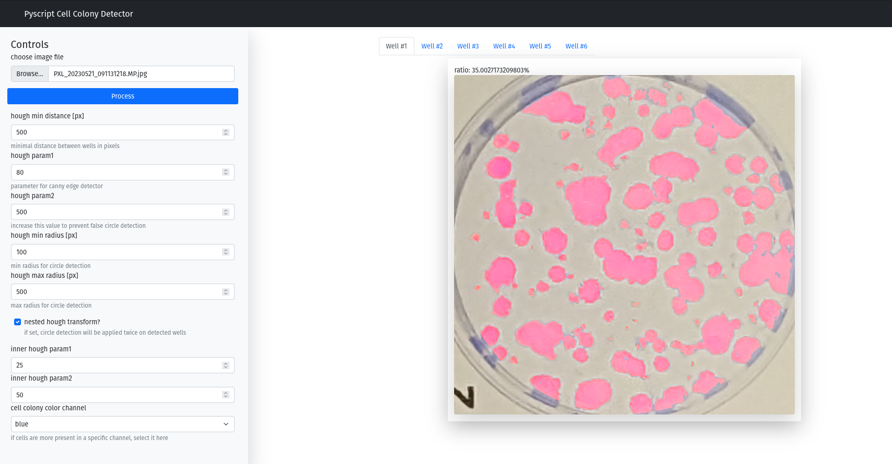

# Cell Colony Detector

this is a simple python webapp, that uses opencv to…

1. cut out single wells from a cell culture plate's image [like this](./img/cell_input_demo.jpg) using [opencv's hough transform](https://docs.opencv.org/3.4/d4/d70/tutorial_hough_circle.html) methods
2. segment cell pixels (by a very simple threshold mechanism)
3. displays the segmented area for each detected well

* **Link to deployed app**: 

